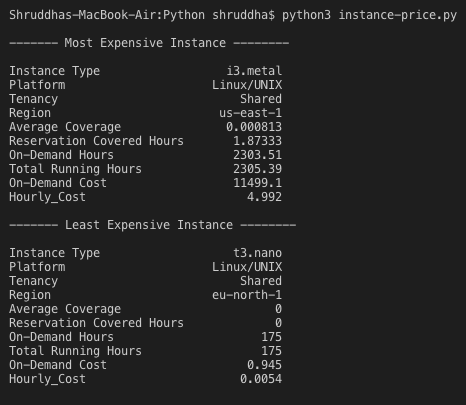
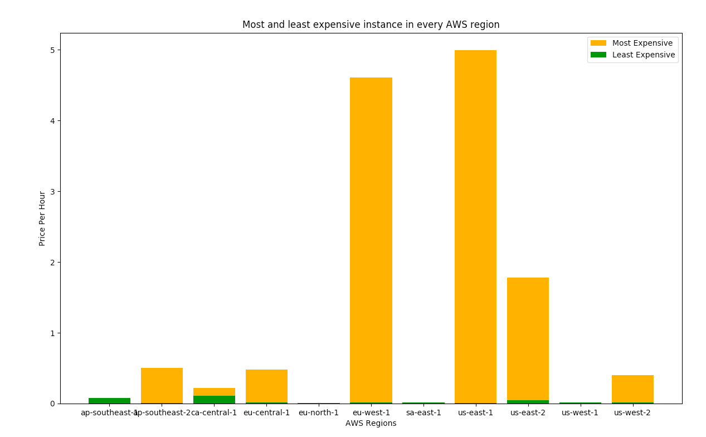
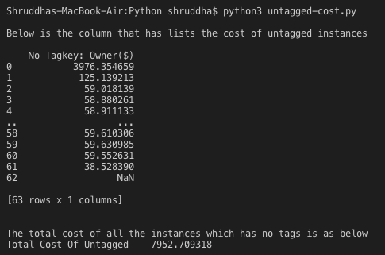

# Cost-Reporting

This project was created as part of SRE - Cost Engineer Assignment described in `SRE_Assignment_2019.docx`.

# What does it contain?

This project contains `./instance-price.py` script written in python that calculates
  1. The least and most expensive AWS instance types given in `ri-instanceTypes.csv` file. Code execution and it's output can      be seen in `./sample-outputs/Output1.png`
  2. The least and most expensive AWS instances in every region and plots them against their on-demand price-per-hour as a bar      graph and displays it on the screen as seen in `./sample-outputs/Output2.png`
  3. It also saves this graph for analysis as an image file `./price-of-instances.jpg`

It also contains another script `untagged-cost.py` which reads from `Tags.csv file`, finds all those instances that does not have tags and calculates the total cost incurred by them. The sample output is represented in `./sample-outputs/Output3`

 is a file which gives few recommendations on how the on-demand costs can be reduced for the usage given in `ri-instanceTypes.csv` file.

# Pre-requisites

This program makes use of Pandas Library for analysing the data. Therefore, it is necessary to intall pandas and can be done using pip3.

`pip3 install pandas`

It also requires NumPy library for handling arrays. This comes as a default package with Python3. If it is not present then we will need to install it using pip3 as below - 

`pip3 install numpy`

For saving the generated graph in jpg format, the program makes use of Python Imaging Library (Pillow) and can be installed using pip3 as usual.

`pip3 install pillow`

# Running the tests

### Sample outputs

